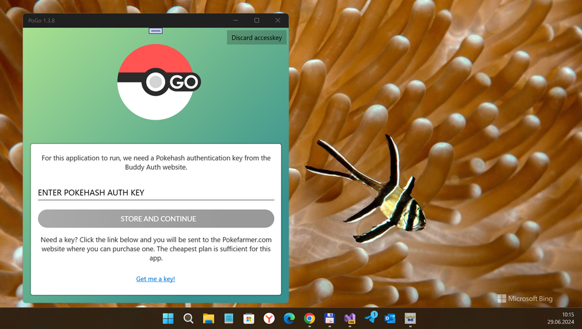

# PoGo (mtaheij's PoGo-UWP 1.2.8 RnD)

My fork of "archived" PoGo-UWP project for quick and dirty "old sweet code exploration". No[t] more, no[t] less. :)

## Screenshots

## Status
- Min. W10M build = 10586 (not 10240!)
- Damaged. Url https://talk.pogodev.org/d/51-api-hashing-service-by-pokefarmer lost. 
- At 2017 year, the Game "was ok" but with some small issues:
- The app is not 100% safe from bans. This means your Trainer account might be banned when you use it. 

## Tech. info
- Check [Wiki](https://github.com/mtaheij/PoGo-UWP/wiki) for information about the project, installing instructions and more in different language.

### Quick info about obsolete version 1.2.2:

To use this App, you will need a (paid) authorization key for a third-party hashing service.

Such a key can be obtained on the following page: https://talk.pogodev.org/d/51-api-hashing-service-by-pokefarmer
A 150 RPM key will be sufficient for this app.

Explanation: Every request that is sent to Niantic's game servers, must be signed by a hash value, calculated from various variables.
Before version 1.2.2, this hashing could be done by the app itself, but the algorithms were changed by Niantic and the crack is not publically available.
So far, the Pokefarmer team is the only one that can provide valid hashes. By using their hashing service - it needs an authorization key - the app is able to sign the requests correctly.

## References
https://github.com/mtaheij/PoGo-UWP

## ..
As is. No support. RnD only. DIY

## .
[m][e] 2024